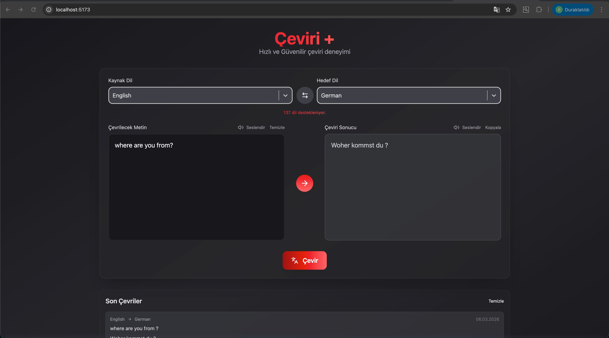

# 🌐 Translate +

- A modern, high-performance translation application built with React 19 and Redux Toolkit. It provides a seamless user experience for translating text across 130+ languages using real-time API integration.

## 🚀 Key Features

- Real-time Translation: Powered by RapidAPI (Deep Translate) for accurate results.

- State Management: Robust global state handling with Redux Toolkit and Async Thunks.

- Voice Synthesis: Integrated Web Speech API for text-to-speech functionality in both source and target languages.

- Smart History: Automatically tracks and lists recent translations locally.

- Modern UI: Responsive design crafted with Tailwind CSS 4 and Lucide icons.

- Language Swap: Intuitive language and text swapping logic.

## 🛠️ Tech Stack

- Framework: React 19 (Vite)

- State: Redux Toolkit (@reduxjs/toolkit)

- Styling: Tailwind CSS 4, React Select

- API: Axios (RapidAPI Integration)

- Icons: Lucide-React

# ScreenShot

# GIFs

# 🌐 Çeviri Websitesi+

- React 19 ve Redux Toolkit kullanılarak geliştirilmiş, 130'dan fazla dili destekleyen modern ve yüksek performanslı bir çeviri uygulamasıdır.

## 🚀 Öne Çıkan Özellikler

- Anlık Çeviri: RapidAPI (Deep Translate) entegrasyonu ile hızlı ve doğru sonuçlar.

- Merkezi State Yönetimi: Redux Toolkit ve Async Thunk yapısı ile tutarlı veri akışı.

- Seslendirme Desteği: Web Speech API ile kaynak ve hedef metinleri sesli dinleme özelliği.

- Çeviri Geçmişi: Yapılan çevirileri otomatik olarak kaydeden ve listeleyen geçmiş sekmesi.

- Modern Arayüz: Tailwind CSS 4 ve Lucide bileşenleri ile optimize edilmiş, şık ve duyarlı (responsive) tasarım.

- Akıllı Değişim: Tek tıkla kaynak ve hedef dilleri/metinleri takas etme özelliği.

## 🛠️ Kullanılan Teknolojiler

- Framework: React 19 (Vite)

- State Yönetimi: Redux Toolkit (@reduxjs/toolkit)

- Tasarım: Tailwind CSS 4, React Select

- API İletişimi: Axios (RapidAPI)

- İkonlar: Lucide-React

# ScreenShot

# GIFs

